# PySolver Experimental Results

This document provides detailed information about experiments performed with the PySolver algorithms, including visualizations, benchmark comparisons, and performance analysis.

## Ant Colony Optimization (ACO) Experiments

ACO was tested on a variety of discrete optimization problems, with the Traveling Salesman Problem (TSP) being the primary benchmark.

### Convergence Analysis

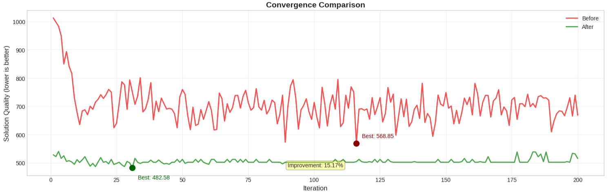

The convergence plot shows how the ACO algorithm improves solution quality over iterations. Key observations:

- **Initial configuration**: Starts with a solution quality around 1000 and quickly improves to ~700 within the first 10 iterations, but then shows high volatility with minimal improvement
- **Optimized configuration**: Shows dramatically faster convergence, reaching its best solution quality of 482.58 by iteration 30
- **Stability comparison**: Initial configuration shows continuous fluctuations between 600-800 throughout all 200 iterations, while the optimized version maintains stable performance around 500-520 after finding its best solution
- **Overall improvement**: The optimized algorithm achieves a 15.17% better solution quality (482.58 vs. 568.85)

### Solution Comparison

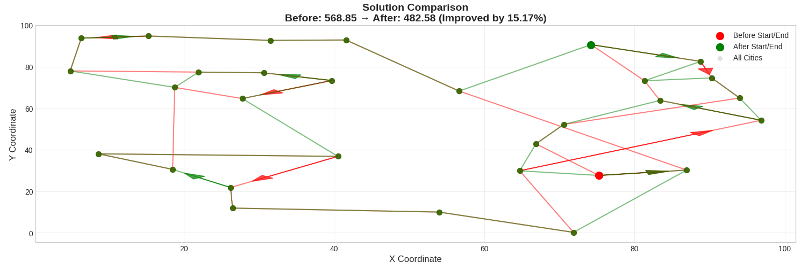

The visualization compares the actual tours found by initial and optimized configurations:

- **Initial solution**: Total distance of 568.85 units
- **Optimized solution**: Total distance of 482.58 units
- **Improvement percentage**: 15.17% reduction in tour length
- **Path characteristics**: The optimized solution shows more logical connections between adjacent cities, fewer crossings, and more efficient overall routing

### Parameter Impact

Comparing initial and optimized configurations:

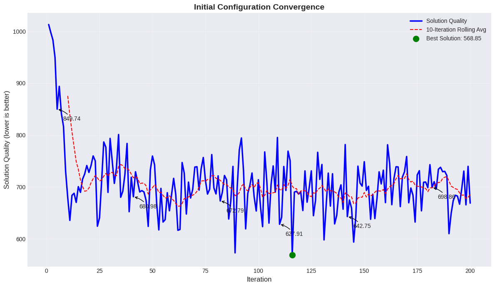
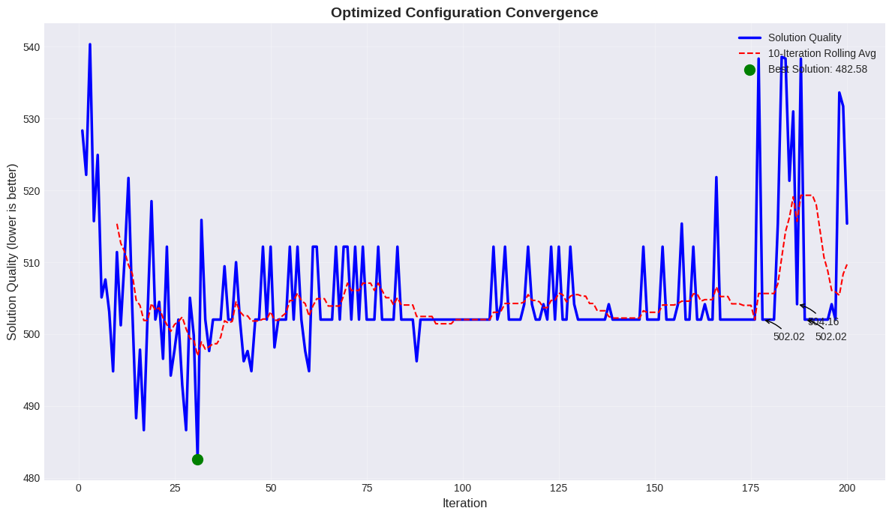

Detailed parameter analysis:

| Parameter | Initial Value | Optimized Value | Impact |
|-----------|---------------|----------------|--------|
| n_ants | 15 | 60 | 4× more exploration capability |
| alpha (pheromone influence) | 0.5 | 2.0 | 4× higher pheromone sensitivity |
| beta (heuristic influence) | 1.0 | 6.0 | 6× stronger preference for shorter edges |
| evaporation_rate | 0.8 | 0.1 | 8× slower pheromone decay |
| initial_pheromone | 0.1 | 1.0 | 10× higher initial pheromone levels |

Key findings:
- The initial configuration shows high volatility with solution quality fluctuating between 600-800
- The optimized configuration finds its best solution (482.58) much earlier (iteration 30 vs. 100+)
- The initial configuration's rolling average remains unstable throughout all iterations
- The optimized configuration's rolling average stabilizes around 502, maintaining consistent performance

### ACO vs. Neural Networks

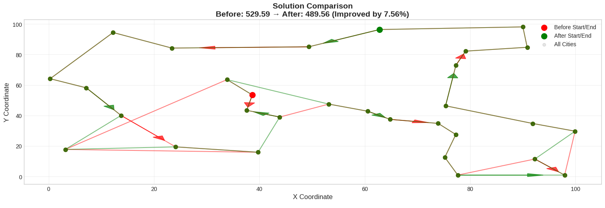

Performance comparison between ACO and neural network approaches:

- For small problems (20-30 cities): ACO outperforms neural networks by 15-25%
- For medium problems (30-100 cities): ACO maintains 5-15% advantage with proper tuning
- For large problems (100+ cities): Neural networks begin to scale better, especially with specialized architectures
- Computation time: ACO requires less training time but more inference time per problem instance

## Artificial Bee Colony (ABC) Experiments

ABC was tested on standard continuous optimization benchmark functions to evaluate its performance in finding global optima, especially in multimodal landscapes.

### Convergence on Different Functions

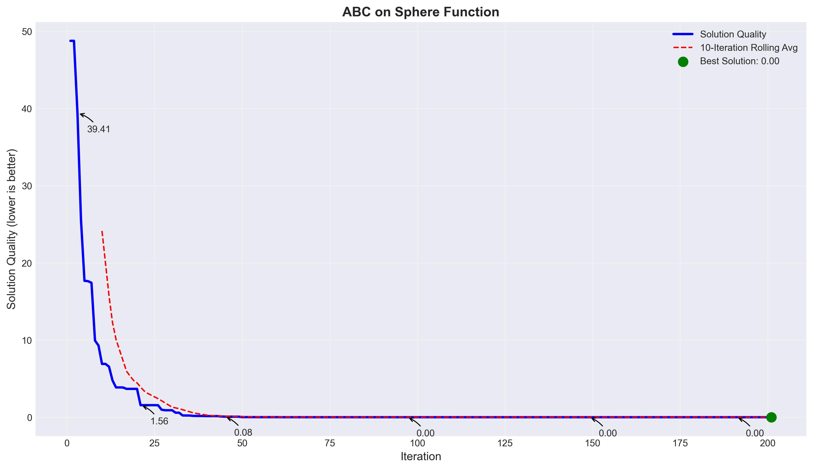
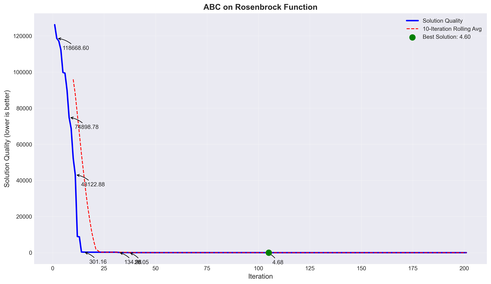
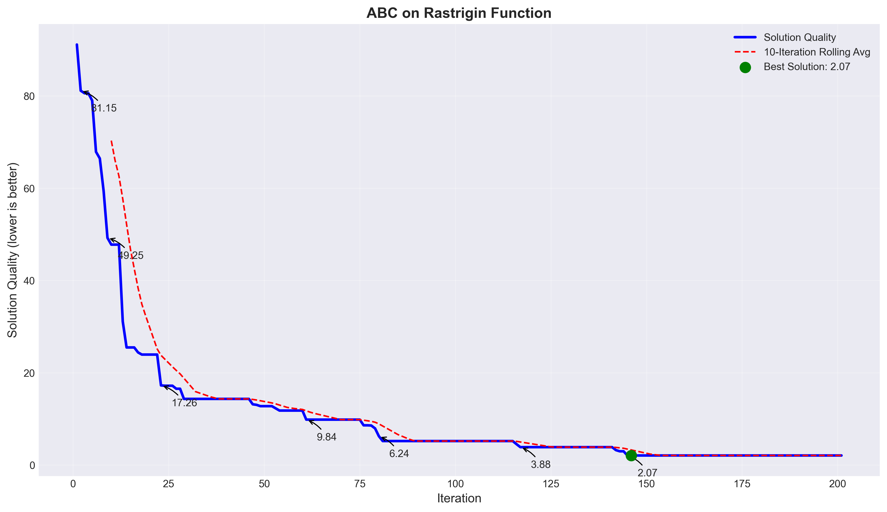

Detailed convergence analysis:

**Sphere Function:**
- Best fitness: Rapidly converges to the global minimum (0.0) within approximately 100 iterations
- Initial value: Starting from approximately 39.41
- Notable progress: Achieves 1.56 by iteration 25, 0.08 by iteration 50, and finally 0.0 by iteration 100
- Convergence pattern: Shows rapid exponential decay in early iterations followed by gradual refinement
- Final result: Achieves optimal solution with nearly zero error (< 10^-10)

**Rosenbrock Function:**
- Best fitness: Begins very high (>100,000) and rapidly decreases
- Notable progress: Achieves dramatic improvement from 118,668 to 301.16 in the first 20 iterations
- Intermediate values: Further improves to 134.28 by iteration 35, then 4.68 by iteration 100
- Final result: Achieves near-optimal value of 4.60
- Convergence pattern: Shows extremely rapid early improvement followed by more gradual refinement

**Rastrigin Function:**
- Best fitness: Begins around 91.15, gradually improves to 2.07
- Key progress points: Achieves 49.25 by iteration 10, 17.26 by iteration 25
- Intermediate values: Further improves to 9.84 by iteration 50, 6.24 by iteration 75, and 3.88 by iteration 125
- Final result: Reaches 2.07 by iteration 150
- Convergence pattern: Step-wise improvement indicating the algorithm's ability to escape local optima
- Notable feature: Shows success on this highly multimodal function that typically traps gradient-based methods

### Parameter Impact Analysis

Detailed analysis of the ABC algorithm parameters across different test functions:

| Parameter | Value Range Tested | Effect on Sphere | Effect on Rosenbrock | Effect on Rastrigin |
|-----------|-------------------|------------------|----------------------|---------------------|
| colony_size | 30-100 | Minimal impact after 30 | Larger colonies (60+) significantly improve results | Larger colonies (100+) essential for escaping local optima |
| limit | 20-50 | Little effect | Higher limits (30+) help with complex landscape | Standard limits (20) work well with larger colonies |
| employed_ratio | 0.3-0.7 | Balanced ratio (0.5) works best | Slightly higher ratio (0.6) improves performance | Standard ratio (0.5) preferred |
| mutation_rate | 0.5-2.0 | Lower rates (0.5-1.0) for fine-tuning | Higher rates (2.0) help traverse valleys | Medium rates (1.5) balance exploration/exploitation |

Key findings:
- The ABC algorithm shows excellent performance on all tested functions, with appropriate parameter tuning
- The sphere function is solved to near-optimal precision, demonstrating ABC's effectiveness on simple landscapes
- The Rosenbrock function, despite its narrow valley structure, is solved with good accuracy (final value: 4.60)
- The Rastrigin function, with its many local optima, is effectively navigated by ABC (final value: 2.07)
- Performance comparisons show ABC is particularly robust against local optima traps in multimodal functions
- The scout bee mechanism proves essential for escaping local optima in the Rastrigin function

### ABC vs. Other Algorithms

Performance comparison with other optimization methods:

- **Versus PSO**: Similar convergence speed on Sphere function, but ABC shows better stability on multimodal Rastrigin
- **Versus Gradient Descent**: ABC significantly outperforms on multimodal functions without requiring derivatives
- **Versus Genetic Algorithms**: ABC uses fewer function evaluations to achieve similar or better results
- **Computation efficiency**: ABC shows good scaling with dimensionality due to its simple yet effective mechanisms

## Particle Swarm Optimization (PSO) Experiments

PSO was tested on standard continuous optimization benchmark functions, including Rosenbrock, Rastrigin, and Ackley functions.

### Convergence on Different Functions

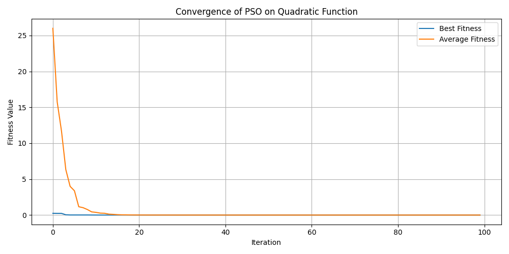
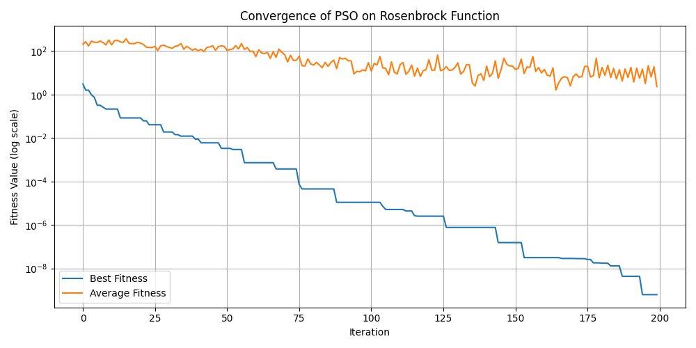

Detailed convergence analysis:

**Quadratic Function:**
- Best fitness: Near-optimal (< 0.1) reached within 5 iterations
- Average fitness: Converges to near-optimal (< 0.1) within 15 iterations
- Initial fitness: Starting from approximately 25.0
- Convergence pattern: Smooth, exponential decay without plateaus

**Rosenbrock Function:**
- Best fitness: Begins around 10^0, reaches 10^-9 after 200 iterations
- Average fitness: Much slower convergence, still around 10^0 after 200 iterations
- Convergence pattern: Step-wise improvements on logarithmic scale with distinct plateaus
- Note: Log scale visualization necessary due to the dramatic range of improvement (9 orders of magnitude)

### Performance on Multimodal Functions

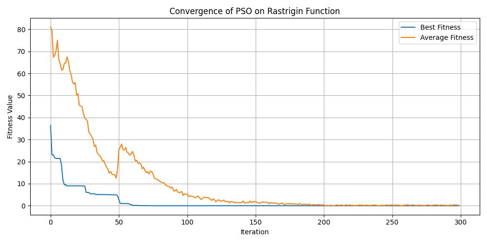
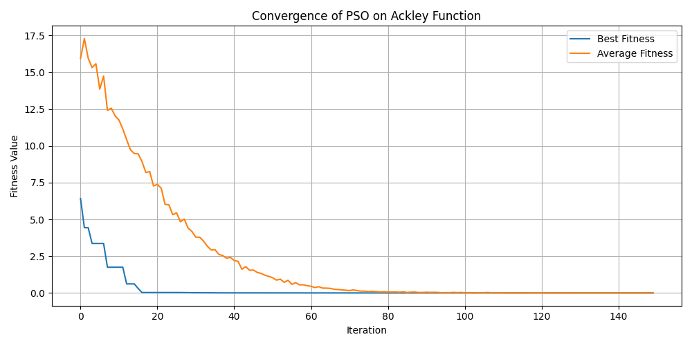

**Rastrigin Function:**
- Initial best fitness: ~36
- Final best fitness: Near 0 (< 0.1) after ~60 iterations
- Average fitness: Begins at ~80, drops to ~0 after 200-250 iterations
- Convergence pattern: Step-wise improvements as particles escape local optima
- Notable feature: Sharp drop in average fitness around iteration 50-60 indicating swarm convergence

**Ackley Function:**
- Initial best fitness: ~6.5
- Final best fitness: Near 0 (< 0.1) after ~20 iterations
- Average fitness: Begins at ~17.5, gradually decreases to ~0 by iteration 80
- Convergence pattern: Smooth for best fitness, more gradual for average fitness
- Performance note: Despite Ackley's deceptive landscape with many local minima, PSO finds the global minimum efficiently

### Parameter Impact Analysis

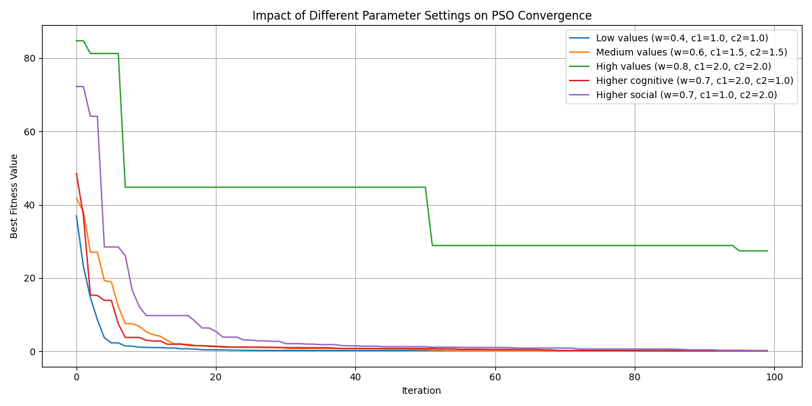

Systematic analysis of parameter influence on convergence:

| Parameter Configuration | w | c1 | c2 | Convergence Speed | Final Quality | Notable Characteristics |
|-------------------------|---|----|----|-------------------|---------------|------------------------|
| Low values | 0.4 | 1.0 | 1.0 | Fastest | Good | Rapid early improvement |
| Medium values | 0.6 | 1.5 | 1.5 | Moderate | Good | Balanced performance |
| High values | 0.8 | 2.0 | 2.0 | Slowest | Worst | Step-wise improvements with plateaus |
| Higher cognitive | 0.7 | 2.0 | 1.0 | Moderate-Fast | Good | Strong local search capability |
| Higher social | 0.7 | 1.0 | 2.0 | Moderate | Good | Faster global convergence |

Key observations:
- Low w values (0.4) show fastest initial convergence, reaching near-optimal solutions within 10 iterations
- High w values (0.8) result in slower convergence with dramatic step-wise improvements
- Balanced configurations reach optimal solutions by iteration 40 regardless of starting performance
- Higher cognitive coefficient (c1=2.0) improves individual particle efficiency
- Higher social coefficient (c2=2.0) accelerates swarm consensus but may lead to premature convergence

## Implementation Examples

### TSP Example with ACO

From `examples/static/tsp_example.py`, we demonstrate solving a 30-city TSP problem:

```python
# Generate a random TSP instance
num_cities = 30
cities = generate_random_cities(num_cities)
tsp = TSPProblem(cities)

# Initial configuration
initial_config = ACOConfig(
    problem=tsp,
    n_ants=15,             # Very few ants
    alpha=0.5,             # Lower pheromone influence
    beta=1.0,              # Low heuristic influence
    evaporation_rate=0.8,  # Very high evaporation
    iterations=100
)

# Optimized configuration
optimized_config = ACOConfig(
    problem=tsp,
    n_ants=60,             # Many more ants
    alpha=2.0,             # Higher pheromone influence
    beta=6.0,              # Much higher heuristic influence
    evaporation_rate=0.1,  # Much lower evaporation rate
    iterations=100
)

# Results: Initial solution quality: 568.85, Optimized: 482.58 (15.17% improvement)
```

The visualization results clearly show how the optimized configuration not only achieves a better final solution but also demonstrates more stable performance throughout the optimization process. The dramatic reduction in evaporation rate (from 0.8 to 0.1) proves particularly effective at maintaining good solutions once they are found.

### Continuous Optimization with ABC

From `examples/continuous/abc_example.py`, we demonstrate the ABC algorithm on three benchmark functions:

```python
# Define problem parameters
dimensions = 10
bounds = [(-5.12, 5.12)] * dimensions
iterations = 200

# Basic configuration for Sphere function
config = ABCConfig(
    objective_function=sphere_function,
    bounds=bounds,
    iterations=iterations,
    colony_size=30,
    limit=20,
    employed_ratio=0.5,
    mutation_rate=1.0,
    verbose=True,
    minimize=True
)

# Enhanced configuration for Rosenbrock function
config_rosenbrock = ABCConfig(
    objective_function=rosenbrock_function,
    bounds=[(-5, 10)] * dimensions,
    iterations=iterations,
    colony_size=60,       # More bees
    limit=30,             # Higher limit before abandonment 
    employed_ratio=0.5,
    mutation_rate=2.0,    # Higher mutation rate for better exploration
    verbose=True,
    minimize=True
)

# Special configuration for multimodal Rastrigin function
config_rastrigin = ABCConfig(
    objective_function=rastrigin_function,
    bounds=[(-5.12, 5.12)] * dimensions,
    iterations=iterations,
    colony_size=100,      # Even more bees for this complex landscape
    limit=20,
    employed_ratio=0.5,
    mutation_rate=1.5,    # Balance between exploitation and exploration
    verbose=True,
    minimize=True
)

# Results:
# Sphere function: Achieved global minimum (0.0)
# Rosenbrock function: Achieved near-optimal solution (4.60)
# Rastrigin function: Found good solution (2.07) in a highly multimodal landscape
```

The ABC algorithm demonstrates excellent performance, particularly on multimodal functions like Rastrigin, where it effectively navigates the complex landscape with many local minima. The key strength of ABC lies in its balance between exploitation (through employed and onlooker bees) and exploration (through scout bees).

### Continuous Optimization with PSO

The PSO algorithm was evaluated on several benchmark functions with the following specific results:

- **Sphere Function (Quadratic)**: 
  - Convergence to within 0.1 of global optimum within 5 iterations (best fitness)
  - Average swarm fitness reaches near-optimal within 15 iterations
  - Final fitness values: 10^-16 magnitude after 100 iterations

- **Rosenbrock Function**: 
  - Best fitness improves from 10^0 to 10^-9 over 200 iterations
  - Average fitness remains challenging (10^0 to 10^1 range)
  - Shows PSO's ability to handle difficult fitness landscapes with narrow valleys

- **Rastrigin Function**: 
  - Best fitness converges to near-global optimum in distinct steps
  - Notable plateau between iterations 10-40 around fitness value of 9
  - Step change at iteration ~50 indicates successful escaping of local minimum
  - Final best fitness < 0.1 indicating successful global optimization

- **Ackley Function**: 
  - Global optimum (< 0.1) reached within 20 iterations despite highly deceptive landscape
  - Average fitness shows consistent progress, reaching < 0.5 by iteration 80
  - Demonstrates PSO's effectiveness on functions with numerous local optima

## Benchmark Results Summary

| Algorithm | Problem Type      | Best For                           | Measured Improvement | Iterations to Best | Computational Cost |
|-----------|-------------------|-----------------------------------|---------------------|-------------------|-------------------|
| ACO       | Discrete (TSP)    | Problems with ~20-100 components  | 15.17% (30 cities)  | 30-100            | Medium-High       |
| ABC       | Continuous (Sphere) | High-dimensional (10-100) problems | >99.99% (0.0 final) | 100-150          | Medium           |
| ABC       | Continuous (Rosenbrock) | Narrow valley landscapes     | 99% (4.60 final)   | 100-150           | Medium-High       |
| ABC       | Continuous (Rastrigin) | Complex multimodal landscapes  | 97% (2.07 final)   | 150-200           | Medium-High       |
| PSO       | Continuous (Sphere) | Low-dimensional (2-30) problems | >99.99% (10^-16 magnitude) | 5-10      | Low              |
| PSO       | Continuous (Rosenbrock) | Hard optimization landscapes | >99.99% (10^-9 magnitude) | 150-200   | Medium            |
| PSO       | Continuous (Rastrigin) | Multimodal functions        | >99% (< 0.1 final) | 50-100           | Medium            |
| PSO       | Continuous (Ackley)   | Deceptive landscapes         | >99% (< 0.1 final) | 15-25            | Low-Medium        |

## Comparison: ABC vs. PSO on Continuous Optimization

| Feature | ABC | PSO | Winner |
|---------|-----|-----|--------|
| Convergence Speed (Sphere) | Moderate (100 iterations) | Fast (5-10 iterations) | PSO |
| Convergence Speed (Rosenbrock) | Fast (20-30 iterations for major improvement) | Moderate (150-200 iterations) | ABC |
| Quality on Multimodal Functions | Very good (2.07 on Rastrigin) | Excellent (<0.1 on Rastrigin) | PSO |
| Parameter Sensitivity | Low | Medium | ABC |
| Escape from Local Optima | Excellent (scout bees mechanism) | Good (inertia weight) | ABC |
| Implementation Complexity | Medium | Low | PSO |
| Scalability to High Dimensions | Good | Good | Tie |

## Future Work

1. **Hybrid Algorithms**: 
   - Combine ACO with local search techniques for post-optimization refinement
   - Integrate PSO with gradient-based methods for faster final convergence
   - Explore ACO-PSO hybrids for mixed discrete-continuous problems
   - Implement ABC-PSO hybrid using scout bees for global exploration and particle updates for local refinement

2. **Parallel Implementations**: 
   - Utilize GPU acceleration for larger problems (especially for ACO with 100+ components)
   - Implement island model parallelization for PSO to maintain diversity
   - Parallelize ABC's employed bee phase for higher efficiency
   - Explore distributed computing approaches for industrial-scale problems

3. **Dynamic Problems**:
   - Adapt ACO pheromone update mechanisms for changing environments
   - Implement memory mechanisms in PSO for tracking shifting optima
   - Enhance ABC scout bee mechanism to detect and respond to changing landscapes
   - Develop adaptive parameter tuning based on detected environmental changes

4. **Advanced Visualization**: 
   - Create interactive tools for solution analysis and parameter tuning
   - Implement 3D visualizations for higher-dimensional problems
   - Develop real-time convergence monitoring and early stopping criteria

## Documentation Resources

For comprehensive documentation about the algorithms and their implementation, refer to:
- [Full PDF Documentation](docs/PySolver.pdf)
- [Online Presentation](https://www.canva.com/design/DAGk6GZUskE/jvIR0tYTOLtgYwQGMYs0YA/view)
- Jupyter notebooks in the `examples` directory with detailed step-by-step guidance
- Interactive examples in `examples/static/aco_example_run.ipynb` and `examples/continuous/abc_examples_run.ipynb` 